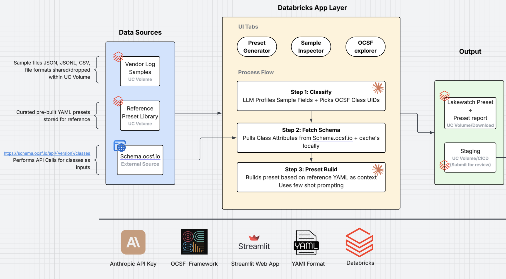

# OCSF Mapper

A Databricks-hosted compiler for OCSF presets. Point it at a vendor sample, and it produces a complete Lakewatch preset — bronze ingestion, silver field extraction, gold OCSF normalization — ready for review and merge into `rearc/security-content-library`.

## Quick Start

Open the app, then in the Generator tab:

```
Sample path:    /Volumes/dsl_dev/internal/ocsf_mapper/samples/vender.json
Vendor:         snyk (example)
Source type:    vulnerabilities (example)
[Generate preset]
```

The tool classifies the sample to the relevant OCSF class, fetches the schema, and generates the preset using existing presets in the library as style references. Review and edit in-app, then click **Submit for review** — the preset is staged on a UC volume and a PR is opened against this repository.

## Architecture

<p align="center">
  
</p>

| Layers | Component | What it does |
|-------|-----------|--------------|
| App | Streamlit (Databricks Apps) | Generates and reviews presets; writes submissions to `staging/pending/` |
| Storage | UC Volume | Hosts vendor samples, the reference preset library, schema cache, and the submission queue |

## Submission Flow

When a user clicks **Submit for review**, the app writes three files to the staging volume:

```
/Volumes/dsl_dev/internal/ocsf_mapper/staging/pending/<submission_id>/
├── preset.yaml          # Generated preset, post-edit
├── report.md            # Generation report (classes, references, token counts)
└── metadata.json        # Submitter identity, OCSF version, classes, timestamp
```

Submission IDs follow the format `<UTC_timestamp>_<vendor>_<source_type>` — for example, `20260430T151155Z_snyk_vulnerabilities`.

The promoter notebook drains `pending/`, computes the target file path (`data_sources/lakewatch/<vendor>/<source_type>/preset.yaml`), commits with the submitter as git author, pushes, and opens a PR. On success the submission moves to `processed/` with `pr_url.txt`; on failure it moves to `failed/` with `error.txt`.

See [`docs/promoter.md`](docs/promoter.md) for the full runbook.

## Repository Layout

```
tools/ocsf-mapper/
├── README.md                         # this file
├── app.py                            # Streamlit entrypoint
├── app.yaml                          # Databricks Apps runtime config
├── config.toml                       # Streamlit theme
├── requirements.txt                  # Python dependencies
├── ocsf_mapper-*.whl                 # ocsf_mapper library (bundled)
└── architecture.png                  # diagram source above
```

## Configuration

Sidebar settings the user controls:

| Setting | Default | Notes |
|---------|---------|-------|
| Anthropic API key | — | Required; not persisted |
| OCSF version | 1.8.0 | Validated against `schema.ocsf.io` |
| Reference library | `/Volumes/dsl_dev/internal/ocsf_mapper/preset_library` | Style anchors for generation |
| Output volume | `/Volumes/dsl_dev/internal/ocsf_mapper/generated_presets` | "Save to Volume" target |

## Deploying

### Prerequisites

| Requirement | Notes |
|-------------|-------|
| Databricks workspace | Apps must be enabled |
| UC Volume access | Read on `/Volumes/dsl_dev/internal/ocsf_mapper/` |
| Anthropic API key | Entered in the sidebar at runtime |

### Deploy from this repo

1. Clone this repository as a Databricks Git folder.
2. Navigate to `tools/ocsf-mapper/`.
3. Create a new Databricks App, pointing its source at this folder.
4. Click Deploy. Databricks reads `app.yaml`, installs `requirements.txt`, and starts the app.

### Local development

```
pip install -r requirements.txt
streamlit run app.py
```

Then enter your Anthropic API key in the sidebar.
